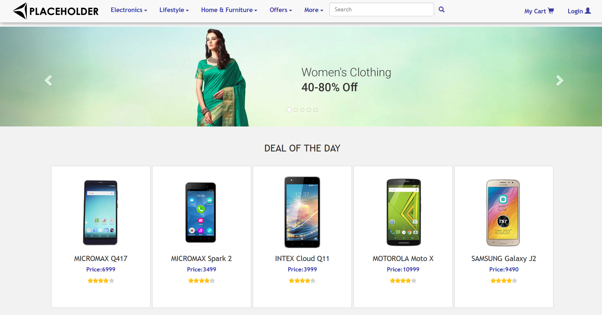

# my-project 
A modern, responsive web application built using HTML, CSS, JavaScript, and Bootstrap.
This project focuses on performance, clean UI, and real-world website structure best practices.

## Features 
* Fully responsive design (mobile,tablet,dekstop)
* Clean and structured UI/UX
* Interactive elements using Javascripts
* Resuable components and scalable layout

## Technologies Used 
* Html5
* CSS3
* Javascript
* Bootstrap

## Screenshot

